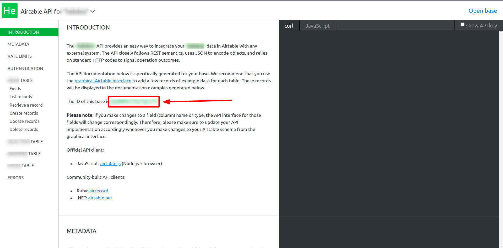
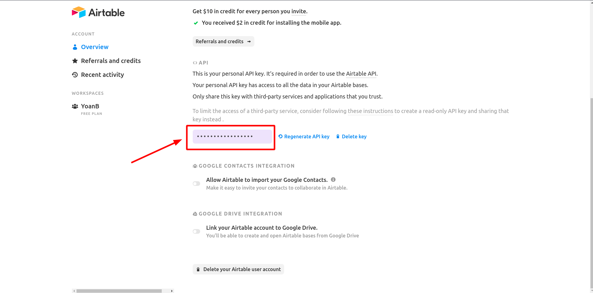

Airtable Client Bundle (Work In Progress)
==================

[](https://github.com/yoanbernabeu/Airtable-Client-Bundle/actions/workflows/code_analysis.yml)
[](https://github.com/yoanbernabeu/Airtable-Client-Bundle/actions/workflows/testing.yml)

The Airtable Client bundle is a Symfony bundle that attempts to make the Airtable API easier to use.

- Retrieve data from a table, optionally choosing a view
- Retrieve a recording by ID

## Installation

Airtable Client Bundle requires PHP 7.4+ and Symfony 5.2+.

Install this bundle using Composer and Symfony Flex:

```sh
composer require yoanbernabeu/airtable-client-bundle
```

To configure Airtable Client Bundle, please create an **airtable_client.yaml** file in **config/packages/** with the following information:

```yaml
airtable_client:
  key:
  id:
```

To find your **Airtable base ID**, go to your **API documentation** and look in the **Introduction** section.



To find your **Airtable API key**, go to your **Account options** and search in the **API** section.



## Usage

```php

use Yoanbernabeu\AirtableClientBundle\AirtableClientInterface;

class Foo
{
    public int $id;
    public string $bar;
}

class FooController
{
    public function bar(AirtableClientInterface $airtableClient)
    {
        $records = $airtableClient->findAll('tableName', 'viewName', Foo::class);
        
        foreach($records as $record) {
            /** @var Foo $foo */
            $foo = $record->getFields();
            
            echo $foo->bar;
        }
        
        $airtableClient->findBy('tableName', 'fieldName', 'value', Foo::class);      
          
        $record = $airtableClient->find('tableName', 'id');
        
        /** @var Foo $foo */
        $foo = $record->getFields();
            
        echo $foo->bar;
        
        $airtableClient->findLast('tableName', 'fieldName');

        $airtableClient->add(
            'tableName',
            [
                'id' => 1,
                'bar' => 'lorem ipsum',
                ClassTest::class
            ]
        );
    }

    // ...
}
```

## License

See the bundled [LICENSE](https://github.com/yoanbernabeu/Airtable-Client-Bundle/blob/main/LICENCE) file.